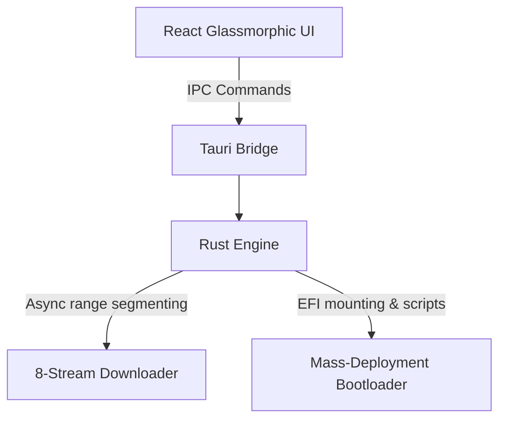

# OSwitch: The Universal Operating Platform

OSwitch is a high-performance desktop application built in Rust and React that automates disk partitioning, operating system provisioning, and developer environment onboarding. It abstracts complex bootloader and partition operations into a secure, one-click interface.

---

## Key Features

* **🛡️ Multi-Layer EFI Safety Guard:** Automated, risk-free volume shrinking and boundary check protection ensuring zero host system corruption or data loss.
* **🚀 8-Stream Parallel Download Engine:** Advanced multi-threaded downloader with segments range requests, live telemetry, and instant SHA256 integrity checks.
* **📦 Unified Package Orchestration (10,590+ Tools):** Comprehensive, pre-verified catalog of developer tools, security utilities, and customized branch bundles (CSE, AI/ML, Cyber Security).
* **🖥️ Steam-Style Telemetry Speedometer:** Dynamic, real-time visualization of parallel segment chunks, active speeds (MB/s), and partition allocation states.
* **🌐 Manage OS Control Dashboard:** Real-time volume utilization analytics, 1-click boot selection, and space reclamation utility.

---

## Architecture

OSwitch utilizes a dual-engine architecture:
1. **Frontend (React + TypeScript):** A sleek, dark glassmorphic Apple-style interface with micro-animations.
2. **Backend (Rust + Tauri):** Memory-safe, low-level async system operations executing disk manipulation and multi-threaded range downloads.



---

## Development & Build

### Prerequisites
* [Node.js](https://nodejs.org/) (v18 or higher)
* [Rust Compiler](https://www.rust-lang.org/tools/install) (Cargo)
* Windows SDK (for disk and system manipulation)

### Installation
1. Clone the repository:
   ```bash
   git clone https://github.com/subbareddypalagiri/osswitch-v2.git
   cd oswitch-v2
   ```
2. Install dependencies:
   ```bash
   npm install
   ```

### Compile & Run
* Run in development mode:
   ```bash
   npm run tauri dev
   ```
* Build production bundles (.msi and .exe):
   ```bash
   npm run tauri build
   ```

---

## License
Licensed under the MIT License - see the [LICENSE](LICENSE) file for details.
